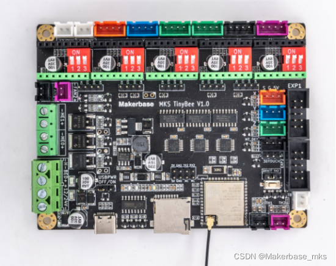

 Guangzhou Qianhui Information Technology Co., Ltd.

MKS TinyBee V1.0Handbuch Link zum Mainboard-Kauf:<a href="https://www.aliexpress.com/item/1005003640084870.html">https://www.aliexpress.com/item/1005003640084870.html</a> 

 <h3>Artikelverzeichnis</h3>
 <ul><li><a href="#_36" target="_self">I. Produktbeschreibung</a></li><li><ul><li><a href="#11_40" Ziel ="_self">1.1 Funktionen und Vorteile</a></li><li><a href="#12_66" target="_self">1.2 Mainboard-Parameter</a></li><li><a href="#13_71" target="_self">1.3 Schaltplan</a></li><li><a href="#14_81" target="_self">1.4 Abmessungen</a></li > </ul>
  </li><li><a href="#_89" target="_self">Zweitens: Firmware herunterladen, kompilieren, aktualisieren</a></li><li><ul><li><a href= "#21_91" target="_self">2.1-Firmware-Download</a></li><li><a href="#22_97" target="_self">2.2-Firmware-Kompilierung</a></li><li><a href="#23_107" target="_self">2.3-Firmware-Upload</a></li></ul>
  </li><li><a href="#_116" target="_self">Drei, Laufwerksunterteilungseinstellungen</a></li><li><ul><li><a href="# 31_A4988_118 " target="_self">3.1 A4988 Treiberunterteilungseinstellung</a></li><li><a href="#32_TMC2208TMC2209TMC2226_125" target="_self">3.2 TMC2208, TMC2209, TMC2226 Normalmodus-Jumpereinstellung </a ></li><li><a href="#33TMC2225_133" target="_self">3.3 TMC2225-Jumpereinstellungen für Normalmodus</a></li></ul>
  </li><li><a href="#Marlin__145" target="_self">4. Konfiguration der Marlin-Firmware</a></li><li><ul><li><a href="#41__147 " target="_self">4.1 Firmware Basiskonfiguration (erforderlich)</a></li><li><ul><li><a href="#411_149" target="_self">4.1.1 Board Konfiguration </a></li><li><a href="#412__154" target="_self">4.1.2 Konfiguration der seriellen Schnittstelle</a></li><li><a href="# 413__164" target="_self">4.1.3 Bildschirmkonfiguration</a></li><li><a href="#414_sd_208" target="_self">4.1.4 SD-Karte aktivieren</a></li> <li><a href="#415_eeprom_214" target="_self">4.1.5 eeprom aktivieren</a></li><li><a href="#416_LCD_226" target="_self" >4.1.6 LCD-Bildschirm-Spracheinstellung</a></li><li><a href="#417_232" target="_self">4.1.7 Umgebungskonfiguration kompilieren</a></li></ul >
   </li><li><a href="#42_238" target="_self">4.2 Konfiguration der Maschinenparameter (Einstellung gemäß Maschinenparameter)</a></li><li><ul><li><a href="#421__240" target="_self">4.2.1 Konfiguration der Anzahl der Extrusionsköpfe</a></li><li><a href="#422__248" target="_self">4.2.2 Heiß Sensible Typkonfiguration</a></li><li><a href="#423__253" target="_self">4.2.3 Limittypkonfiguration</a></li><li><a href= " #424__258" target="_self">4.2.4 Impulseinstellung</a></li><li><a href="#425__263" target="_self">4.2.5 Nullrichtungseinstellung</a></li><li><a href="#426__268" target="_self">4.2.6 Bereichseinstellungen der Druckplattform</a></li><li><a href="#427_271" target="_self ">4.2.7 Motorrichtungseinstellung</a></li></ul>
   </li><li><a href="#43_277" target="_self">4.3 Erweiterte Konfiguration</a></li><li><ul><li><a href="#431__279" target ="_self">4.3.1 Neustart nach Stromausfall</a></li><li><a href="#432__286" target="_self">4.3.2 Materialbrucherkennung</a></li ><li><a href="#433_wifi_312" target="_self">4.3.3 WLAN-Konfiguration</a></li></ul>
  </li></ul>
  </li><li><a href="#3dtouch_342" target="_self">5. Automatische 3dtouch-Nivellierungsfunktion</a></li><li><ul><li><a href=" #51_344" target="_self">5.1 Sensor-Triggerpegel einstellen</a></li><li><a href="#52pin_349" target="_self">5.2 Sensorsignal-Pin einstellen</a></li><li><a href="#53_BLTOUCH_363" target="_self">5.3 BLTOUCH aktivieren</a></li><li><a href="#54_367" target="_self">5.4 Festlegen der Versatz zwischen Sonde und Extrusionskopf</a></li><li><a href="#55_372" target="_self">5.5 Stellen Sie den Abstand zwischen dem Sensor und der Kante der Druckplattform beim Nivellieren ein</a></li><li><a href="#56__378" target="_self">5.6 Automatische Ausrichtung aktivieren</a></li><li><a href="#57__383" Ziel = "_self">5.7 Nivellierungsrasterpunkte setzen</a></li><li><a href="#58__390" target="_self">5.8 Servo aktivieren</a></li><li><a href="#59__396" target="_self">5.9 Auto-Leveling-Datenaufrufcode hinzufügen</a></li><li><a href="#510_z_safe_homing__407" target="_self">5.10 z_safe_homing-Konfiguration</a></li></ul>
  </li><li><a href="#WEB_411" target="_self">Sechs, Konfiguration der WEB-Verbindung</a></li><li><a href="#FAQ_460" target="_self" >7. FAQ</a></li></ul>

Maker Base QQ-Gruppe: 489095605 232237692  E-Mail: Huangkaida@makerbase.com.cn

<h1>I. Produktbeschreibung</h1>

Das MKS TinyBee V1.0-Mainboard ist eine 32-Bit-Hauptsteuerplatine, die von Maker Base eingeführt wurde, um die Marktnachfrage zu befriedigen.Das Mainboard unterstützt die WLAN-Funktion ohne zusätzliches WLAN-Modul, unterstützt die Webseitensteuerung, unterstützt LCD2004, LCD mini12864, MKS mini12864 V3 .0, LCD12864, unterstützt die serielle Bildschirmsteuerung. 

<h2>1.1 Funktionen und Vorteile</h2>

1. Unterstützung der WLAN-Steuerung und Übertragung von Dateien;  2. Die Treiberunterteilung ist auf die Wähleinstellung eingestellt, die für die Treiberunterteilungseinstellung bequemer ist;  3. Die Hauptplatinenplatine nimmt das Immersionsgold an Prozess, der eine bessere Stabilität hat   3. Benutzer können den Motorantrieb selbst ersetzen, unterstützen 4988, 8825, 8729, TMC2208, TMC2209, TMC2225, TMC2226;   4. Reservieren Sie externe Antriebssignale, die angeschlossen werden können externe große Laufwerke zum Antrieb von 57, 86 Motoren ;  5. Verwendung hochwertiger MOSFETs, bessere Wärmeableitung, Gewährleistung der Langzeitstabilität; ;  7. Die stabile und zuverlässige Filterschaltung reduziert die Möglichkeit von Störungen erheblich, und vermeidet so weit wie möglich das Phänomen des Absturzes und Herumlaufens im Druckprozess;  8. Verwendung des seriellen CH340-Port-Chips unter der Prämisse, Stabilität und Zuverlässigkeit zu gewährleisten. Dies reduziert die Kosten und löst das Problem des vorherigen 16U2-Treibers war schwierig zu installieren;  9. Verwenden Sie die Open-Source-Firmware Marlin2.0.X-Firmware;  10. Unterstützt LCD2004, LCD12864, MKS MINI12864 V1.0, MKS MINI12864 V3.0, unterstützt TFT24, TFT28, TFT32, TFT35, H43-Touchscreen, entwickelt von Maker;  11. XYZ-Achsen verwenden Klemmen in verschiedenen Farben, um dem Motor und Endschalter zu entsprechen, was für die Verkabelung praktisch ist;  12. Unterstützung von 3dtouch;  13. Onboard TF-Kartenhalter, stabilerer Offline-Druck;

<h2>1.2 Motherboard-Parameter</h2>

<h2>1.3 Schaltplan</h2>

 
<h2>Zeichnung der Größe 1,4</h2>

Motherboard-Größentabelle:  

<h1>Zweitens Firmware herunterladen, kompilieren, aktualisieren</h1>
<h2>2.1-Firmware-Download</h2>

MKS TinyBee V1.0-Firmware-Download-Link:  <a href="https://github.com/makerbase-mks/MKS-TinyBee">https://github.com/makerbase-mks/MKS-TinyBee</a>

<h2>2.2-Firmware-Kompilierung</h2>

Firmware-Kompilierung erfordert VScode, VScode-Installations-Tutorial-Link:  <a href="https://www.bilibili.com/video/BV1XK4y1C7k5">https://www.bilibili.com/video/BV1XK4y1C7k5</a>

Firmware-Kompilierung:  Nachdem die Firmware-Konfiguration abgeschlossen ist, klicken Sie auf "✔" in der unteren linken Ecke der VScode-Seite, um mit der Kompilierung zu beginnen.   

<h2>Upload der 2.3-Firmware</h2>

Klicken Sie nach dem Kompilieren der Firmware auf „→“ in der unteren linken Ecke der VScode-Seite, um mit dem Hochladen der Firmware zu beginnen. 

<h1>Drittens die Unterteilungseinstellungen für Fahrer</h1>
<h2>3.1 A4988-Treiberunterteilungseinstellungen</h2>

A4988 Treiber-Unterteilungseinstellung, die drei Zifferblätter unterhalb des Treibers werden bis zu 16 Unterteilungen angewählt, wie in der folgenden Abbildung gezeigt (X-Achse als Beispiel):

<h2>3.2 TMC2208, TMC2209, TMC2226 Normalmodus-Jumpereinstellungen</h2>

Die drei Zifferblätter an der Unterseite der TMC2208-, TMC2209- und TMC2226-Treiber sind 16 Unterteilungen, wenn sie angewählt sind, wie in der Abbildung unten gezeigt (X-Achse als Beispiel):

<h2>3.3 TMC2225-Jumpereinstellungen für Normalmodus</h2>

Unterteilungseinstellungen des TMC2225-Treibers, die zweite Skala unter dem Treiber ist angewählt, die erste und dritte Skala sind 16 Unterteilungen, wie in der folgenden Abbildung gezeigt (X-Achse als Beispiel):

<h1>Viertens: Konfiguration der Marlin-Firmware</h1>
<h2>4.1 Firmware-Basiskonfiguration (erforderlich)</h2>
<h3>4.1.1 Platinenkonfiguration</h3>

Konfigurieren Sie das Board als BOARD_MKS_TINYBEE in der Datei configuration.h  

<h3>4.1.2 Konfiguration der seriellen Schnittstelle</h3>

Setzen Sie den ersten seriellen Port in der Datei configuration.h auf 0, der Konfigurationsfehler führt dazu, dass das Motherboard keine Verbindung zum Computer herstellen kann; der zweite serielle Port ist auf -1 konfiguriert, die Konfigurationsfehler-Webseite wird dies nicht tun in der Lage sein, die Temperaturinformationen des Motherboards zu erhalten; Dann sind die Baudraten alle auf 115200 eingestellt. 

  

<h3>4.1.3 Bildschirmkonfiguration</h3>

<strong>(Hinweis: Der LCD-Bildschirm kann nur einen der folgenden Bildschirme aktivieren, und das gleichzeitige Aktivieren von mehr als einem führt zu Kompilierungsfehlern)</strong>  1. LCD 2004-Konfiguration, in der Konfiguration Datei aktivieren

<h3>4.1.3 Bildschirmkonfiguration</h3>

<strong>(Hinweis: Der LCD-Bildschirm kann nur einen der folgenden Bildschirme aktivieren, und das gleichzeitige Aktivieren von mehr als einem führt zu Kompilierungsfehlern)</strong>  1. LCD 2004-Konfiguration, in der Konfiguration Datei aktivieren

#define REPRAP_DISCOUNT_SMART_CONTROLLER

2, LCD12864-Bildschirmkonfiguration, in der Konfigurationsdatei aktivieren

#define REPRAP_DISCOUNT_FULL_GRAPHIC_SMART_CONTROLLER

3. MKS MINI12864 V1.0 Bildschirmkonfiguration

In Konfigurationsdatei aktivieren

#define MKS_MINI_12864

4. MKS MINI12864 V3.0 Bildschirmkonfiguration

Aktiviere #define MKS MINI12864 V3 in der Konfigurationsdatei

<h3>4.1.4 SD-Karte aktivieren</h3>

Aktivieren Sie <code>#define SDSUPPORT</code>  in der Konfigurationsdatei

 

<h3>4.1.5 EEPROM aktivieren</h3>

In Konfigurationsdatei aktivieren

#define EEPROM_SETTINGS

  `

<h3>4.1.6 Spracheinstellung des LCD-Bildschirms</h3>

Setzen Sie die Sprache in der Konfigurationsdatei auf zh_CN für Chinesisch, die Voreinstellung ist Englisch. 

<h3>4.1.7 Konfiguration der Kompilierungsumgebung</h3>

Konfigurieren Sie die Kompilierungsumgebung als mks_tinybee in der Datei paltformio.ini

<h2>4.2 Konfiguration der Maschinenparameter (gemäß Maschinenparameter eingestellt)</h2>
<h3>4.2.1 Konfiguration der Anzahl der Extrusionsköpfe</h3>

MKS TinyBee V1.0 unterstützt bis zu 2 Extrusionsköpfe bei Verwendung von Dual-ExtrusionWenn Sie ausgehen, müssen Sie die thermischen und SD-Kartenerkennungs-Pin-Jumper des Thermoextruders 2 auf der Hauptplatine rechts einstecken.   

<h3>4.2.2 Thermische Konfiguration</h3>

MKS TinyBee V1.0 Motherboard unterstützt nur 100K Thermal, #define TEMP_SENSOR_0 ist Extrusionskopf 1, #define TEMP_SENSOR_1 ist Extrusionskopf 2, #define TEMP_SENSOR_BED ist heißes Bett  
<h3>4.2.3 Konfiguration des Grenzwerttyps</h3>

Konfiguration des Endschaltertyps (wahr/falsch), wahr ist ein normalerweise offener Schalter, falsch ist ein normalerweise geschlossener Schalter.   

<h3>4.2.4 Pulseinstellungen</h3>

#define DEFAULT_AXIS_STEPS_PER_UNIT {80, 80, 400, 93} in der Konfigurationsdatei wird verwendet, um die Impulse der X-, Y-, Z- bzw. E-Achse einzustellen.Der Impulswert muss entsprechend dem tatsächlichen Wert berechnet und eingestellt werden Zustand der Maschine.   

<h3>4.2.5 Nullrichtungseinstellung</h3>

Stellen Sie die Nullungsrichtung in der Konfigurationsdatei ein, -1 ist die minimale Richtung, 1 ist die maximale Richtung  

<h3>4.2.6 Bereichseinstellungen der Druckplattform</h3>

<h3>4.2.7 Motorrichtungseinstellung</h3>

Die Einstellung der Motorrichtung, falsch und wahr, stellen die beiden Drehrichtungen dar, wenn die Bewegungsrichtung entgegengesetzt ist, kann die entgegengesetzte Konfiguration vorgenommen werden. 

<h2>4.3 Erweiterte Konfiguration</h2>
<h3>4.3.1 Neustart nach Stromausfall</h3>

Aktivieren Sie in der erweiterten Konfigurationsdatei configuration_adv.h  #define POWER_LOSS_RECOVERY und ändern Sie #define PLR_ENABLED_DEFAULT false in  #define PLR_ENABLED_DEFAULT true  

<h3>4.3.2 Materialbrucherkennung</h3>

Aktivieren Sie #define FILAMENT_RUNOUT_SENSOR in der Konfigurationsdatei  

Stellen Sie den Pegel des Unterbrechungserkennungsschalters in der Konfigurationsdatei ein (LOW/HIGH)

Aktiviere #define NOZZLE_PARK_FEATURE in der Konfigurationsdatei

Aktiviere #define ADVANCED_PAUSE_FEATURE im erweiterten Profil

Aktiviere #define PARK_HEAD_ON_PAUSE in der erweiterten Konfigurationsdatei

<h3>4.3.3 WLAN-Konfiguration</h3>

Aktivieren Sie #define ESP3D_WIFISUPPORT und #define WEBSUPPORT, #define OTASUPPORT, #define WIFI_CUSTOM_COMMAND in der erweiterten Konfigurationsdatei

<h1>5. Automatische 3dtouch-Nivellierungsfunktion</h1>
<h2>5.1 Sensorauslösepegel einstellen</h2>

Die Stufe von 3dtouch ist auf „false“ gesetzt  

<h2>5.2 Sensorsignal-Pin einstellen</h2>

Da auf der Hauptplatine nur eine z_min-Grenzschnittstelle vorhanden ist, muss z_safe_homing aktiviert werden, um die automatische Nivellierung von 3Dtouch zu verwenden (Hinweis: Die 3Dtouch-Signalsteuerleitung ist eine 2-polige Leitung, eine schwarze und eine weiße Leitung, die weiße Leitung ist die Signalleitung, verbunden mit Z_min limit S end). 

<h2>5.3 BLTOUCH aktivieren</h2>

<h2>5.4 Einstellen des Versatzes zwischen Sonde und Extrusionskopf</h2>

 sind die Offsets der X-, Y- bzw. Z-Achse. Die Offsets von X und Y müssen entsprechend der tatsächlichen Messung ausgefüllt werden. Z_offset kann nach der Nivellierung angepasst werden.   

<h2>5.5 Stellen Sie den Abstand zwischen dem Sensor und der Kante der Druckplattform beim Nivellieren ein</h2>

Der Wert ist standardmäßig 10 (Hinweis: Der Wert kann nicht zu klein eingestellt werden, ein zu kleiner Wert führt dazu, dass der Sensor die Plattformreichweite während des Nivellierens überschreitet, was zu einem Nivellierungsfehler führt)  
<h2>5.6 Auto-Level aktivieren</h2>

Aktivieren Sie die lineare automatische Ausrichtung in der Konfigurationsdatei  

<h2>5.7 Nivellierungsrasterpunkte festlegen</h2>

Stellen Sie die Anzahl der Nivellierungspunkte in der Konfigurationsdatei ein, der Standardwert ist 3*3 Punkte

<h2>5.8 Servo aktivieren</h2>

Servos in der Konfigurationsdatei aktivieren #define NUM_SERVOS 1  

<h2>5.9 Auto-Leveling-Datenaufrufcode hinzufügen</h2>

set_bed_leveling_enabled(true) in G28.cpp-Datei hinzufügen;

<h2>5.10 z_safe_homing-Konfiguration</h2>

<h1> Sechs, WEB-Verbindungskonfiguration</h1>

Die Firmware aktiviert WLAN. Nachdem das Motherboard aktualisiert wurde, ist das Standard-WLAN der AP-Modus (Local Area Network). Verwenden Sie dann den Computer oder das Mobiltelefon, um die WLAN-Liste anzuzeigen. Sie können sehen, dass der Name des WLANs marlin_esp lautet . 

Geben Sie das Passwort ein, um eine WLAN-Verbindung herzustellen (das standardmäßige WLAN-Passwort lautet 12345678);  

Öffnen Sie dann den Browser und geben Sie die IP-Adresse ein, um die Weboberfläche aufzurufen (die Standard-IP-Adresse ist 192.168.0.1);

Klicken Sie dann zum Hochladen der Datei der Websteuerungsschnittstelle auf den Link zum Herunterladen der Datei: <a href="https://github.com/luc-github/ESP3DLib">https://github.com/luc-github/ESP3DLib</a>

    Überprüfen Sie nach dem Hochladen die Aktualisierungszeit auf der Webseite, und Sie können die Steuerung starten, wenn Sie die Temperatur sehen  <  STA-Modus-Einstellung, ESP3D-Schnittstelle aufrufen, wählen Sie dann Client Station, geben Sie den Namen und das Passwort des WLANs ein, mit dem Sie sich verbinden möchten, überprüfen Sie die Einstellungen und starten Sie das Motherboard neu. Wenn es sich um ein LCD handelt, können Sie die zugewiesene IP auf der LCD-Oberfläche anzeigen. Wenn Sie einen seriellen Anschlussbildschirm oder keinen Bildschirm verwenden, müssen Sie sich auf der Verwaltungsseite des Routers anmelden, um die IP anzuzeigen, und dann die IP erneut eingeben den Browser, um die Webseite aufzurufen.   

7. Technischer Support und Garantie   Einschalttest wird vor der Lieferung durchgeführt, um sicherzustellen, dass es vor der Lieferung offiziell verwendet werden kann.    Willkommen Freunde zur Teilnahme an der Diskussionsgruppe: 232237692   Willkommen zur Blog-Kommunikation: https://blog.csdn.net/gjy_skyblue   3D-Drucker-Motherboard-Anpassung, kontaktieren Sie Huang Sheng: 13148932315 Tan Sheng: 15521395023 Peng Sheng: 13427595835   Wenn Sie Fragen haben, wenden Sie sich bitte an unseren Kundenservice oder finden Sie technische Supportmitarbeiter in der Gruppe, wir werden Ihnen von ganzem Herzen zur Verfügung stehen

<h1> Sieben, häufig gestellte Fragen</h1>

1. Was soll ich tun, wenn das Motherboard die Firmware nicht aktualisieren kann?   Antwort: Überprüfen Sie, ob der Computer den COM-Port des Motherboards erkennt, der Gerätemanager des Computers kann den COM-Port des CH340 sehen;   Wenn das Motherboard zu stark belastet wurde, wird davon abgeraten Verwenden Sie USB, um das Motherboard mit Strom zu versorgen Um die Firmware zu aktualisieren, kann es leicht vorkommen, dass die Firmware aufgrund unzureichender Stromversorgung nicht aktualisiert werden kann;   Das Motherboard kann nicht mit dem seriellen Bildschirm verbunden werden, während es mit dem Computer verbunden ist, um die Firmware zu aktualisieren, und Der serielle Bildschirm muss getrennt werden. 

2. Nach der Aktualisierung der Firmware sind der angezeigte Puls, die maximale Geschwindigkeit und andere auf dem LCD-Bildschirm angezeigte Parameter falsch. Was tun?  Antwort: Rufen Sie die erweiterte Einstellungsschnittstelle auf dem Bildschirm auf, initialisieren Sie dann das Eeprom Zurück zur Einstellungsoberfläche, Daten speichern, Daten laden

3. Was soll ich tun, wenn das Motherboard nicht mit dem Host-Computer des Computers verbunden werden kann?   Antwort: Bestätigen Sie, ob die serielle Schnittstelle des Motherboards in der Konfigurationsdatei korrekt ist, MKS Tibybee verwendet die serielle Schnittstelle 0;   Nachdem das Motherboard mit dem Computer verbunden ist, rufen Sie den Geräte-Manager auf, um zu überprüfen, ob der Computer die erkennt COM-Port des Motherboards, wenn ja, können Sie den Host-Computer neu starten, die vom Host-Computer eingestellte Baudrate muss mit der Einstellung der Konfigurationsdatei übereinstimmen; wenn sie nicht erkannt wird, überprüfen Sie, ob die USB-Verbindung einen schlechten Kontakt hat. 

4. Was soll ich tun, wenn der automatische Nivellierungseffekt von 3Dtouch nicht gut ist?   Antwort: ⭐Die Anzahl der Nivellierungspunkte kann erhöht werden; ⭐Das #define MULTIPLE_PROBING 2 kann in der Konfigurationsdatei aktiviert werden, und das Nivellieren kann an jedem Punkt wiederholt werden, um einen Mittelwert mit höherer Genauigkeit zu erhalten;  ⭐Automatisch umschaltbar Der Weg zum Nivellieren, #define AUTO_BED_LEVELING_LINEAR eignet sich für Plattformen mit geneigter Ebene  #define AUTO_BED_LEVELING_BILINEAR eignet sich für gekrümmte unebene Plattformen und große Plattformen. 

5. Wie gehe ich mit dem Ausfall der automatischen Nivellierung um?   Es gibt viele Gründe, warum die automatische Ausrichtung fehlschlägt, wir haben ein Video darüber gemacht, siehe den Link für Details:

<a href="https://www.bilibili.com/video/BV1ZB4y1P7LZ?from=search&amp;seid=12028097711066543268">https://www.bilibili.com/video/BV1ZB4y1P7LZ?from=search&amp;seid=12028097711066543268</a>

